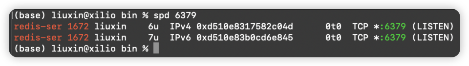
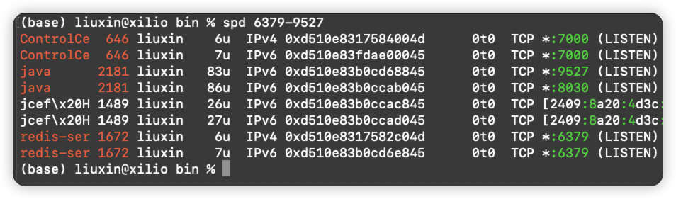
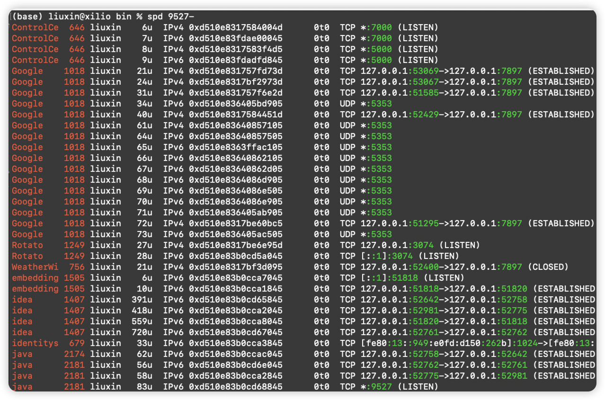
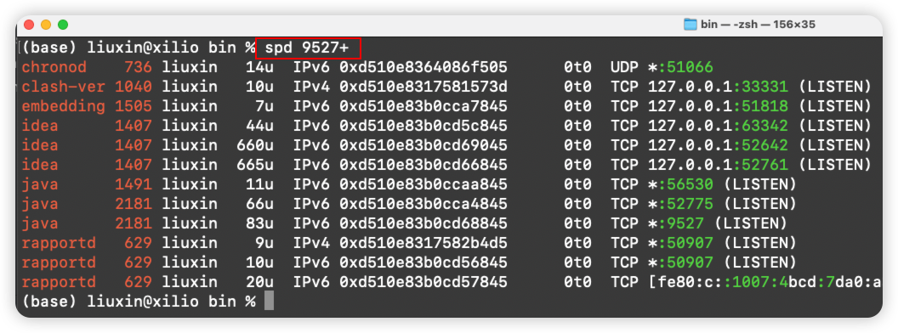

<div align="center">
  <a href="https://github.com/xiaoniucode/spd/stargazers">
    
  </a>
  <a href="https://github.com/xiaoniucode/spd/forks">
    
  </a>
  <a href="https://github.com/xiaoniucode/spd/blob/main/LICENSE">
    
  </a>
 <a href="https://github.com/xiaoniucode/spd/releases/v1.0.0">
    
  </a>
</div>

# 介绍
`spd`是一个轻量级的通过端口号查询正在运行进程信息的工具，支持精准查找和范围查找，解决Linux/MacOS原生命令使用繁琐问题。

## 功能特性

- 查看`小于`某个端口的所有进程：`spd port-`
- 查询`大于`某个端口的所有进程: `spd port+`
- `精准`查询某个端口的进程: `spd port`
- 查询某个`范围`的所有进程: `spd start-end`

## 安装教程
将[spd.sh](spd.sh)脚本下载下来保存到`/usr/local/bin`目录下，添加执行权限。
```shell
sudo mv spd.sh /usr/local/bin/spd
sudo chmod +x spd.sh
```

输入`spd`可查看用法：
```shell
(base) liuxin@xilio bin % spd
Usage: spd <port_range>
Examples:
spd 8000- : List processes with ports below 8000
spd 8000+ : List processes with ports above 8000
spd 8000-9000: List processes with ports between 8000 and 9000 (inclusive)
spd 8000 : List processes using port 8000
```

## 使用案例
### 单个查询



### 范围查询



### 小于指定端口


### 大于指定端口


## 问题反馈

反馈问题:[issues](https://github.com/xiaoniucode/spd/issues)


